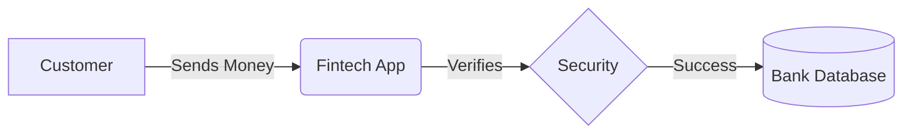
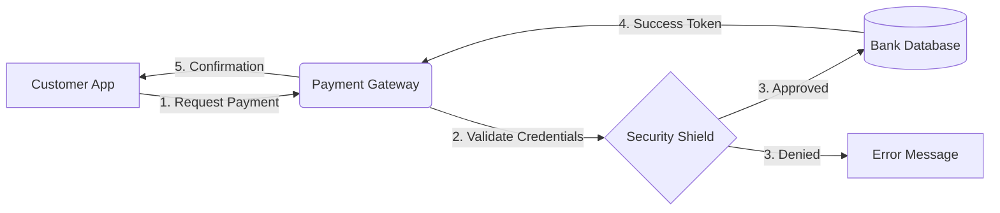

# Fintech Technical Glossary
Welcome to my technical glossary.  This project is a living document where I translate complex financial concepts into chear, developer-friendly documentation.

## Table of Contents
* [Core Concepts](#core-concepts)
* [Regulatory Standards](#regulatory-standards)
* [Technology Stack](#technology-stack)

## Core Concepts

### API (Application Programming Interface)
An **API** acts as a bridge between two software programs.  In Fintech, APIs allow your bank to talk to apps like *Venmo* or *Stripe* securely.

### KYC (Know Your Customer)
**KYC** is a mandatory process where businesses verify the identity of their clients.
* **Purpose:** To prevent money laundering and fraud.
* **Key Step:** Validating government-issed IDs.

### PCI DSS (Payment Card Industry Data Security Standard)
A set of security standards designed to ensure that **all** companies that accept, process, store, or transmit credit card information maintain a secure environment.

### Blockchain
A distributed, decentralized ledger technology.   In Fintech, it is used to record transactions across many computers so that the record cannot be altered retroactively.

### SaaS (Software as a Service)
A software licensing and delivery model in which software is licensed on a subscription basis and is centrally hosted.  Most modern Fintech tools (like *QuickBooks Online*) are SaaS.

### SME digitisation
SME digitisation is the process of integrating digital technologies into all areas of a Small or Medium-sized Enterprise.

### Google's AP2 (Agent Payments Protocol)
Google's AP2 (Agent Payments Protocol) is an open, industry-standard framework for securely enabling AI agents to make purchases on behalf of users, acting as a trusted layer for agent-led commerce by establishing verifiable intent through cryptographic mandates and creating an audit trail for accountability.

### Middle East and North Africa (MENA)
MENA stands for the Middle East and North Africa, a broad geographic and cultural region encompassing countries from Morocco to Iran, known for its rich history, diverse ethnicities, significant energy reserves (oil/gas), and complex geopolitics, often used by academic, economic, and governmental bodies to group these nations

## Regulatory Standards

### AML (Anti-Money Laundering)
A set of laws, regulations, and procedures intended to prevent criminals from disguising illegally obtained funds as legitimate income.  In Fintech, documentation must clearly outline how software flags suspicious activity.

### GDPR (General Data Protection Regulation)
A legal framework that sets guidelines for the collection and processing of personal information from individuals who live in the European Union (EU).
* **Note:** Even if a company is based in the US, if they have one customer in the SU, they must be GDPR compliant.

## Technology Stack

### Cloud Computing (AWS/Azure)
Most Fintechs host their data on remote servers (the "Cloud") rather than physical hardware in an office. This allows for global scaling and high-level security.

#Encryption at Rest vs. In Transit
* **At Rest:** Data is protected while it is stored on a disk.
* **In Transit:** Data is protected while it is moving between a user's phone and the bank's server. 

## System Flow
 

## System Visualizations

